# Milestone 2 — Entity Relationship Diagram (ERD)

## Overview

The Synthos database uses PostgreSQL via Prisma ORM. The schema models a creative intelligence platform with project workflow automation, a job board, talent management, company verification, and social features.

## Core Entities

### User
Central account entity. Roles: `talent`, `client`, `admin`. Links to companies, projects, tasks, applications, and social features.

### Project
The primary workflow entity. Each project progresses through 10 stages: `brief` → `call` → `contactReport` → `productionMeeting` → `proposal` → `quote` → `approval` → `transcript` → `understanding` → `projectBrief` → `workshop` → `synthesis`.

Each stage has a dedicated sub-model (Brief, ClientCall, Transcript, Understanding, ProjectBrief, Workshop, Synthesis, Proposal, Quote, Approval, ContactReport, ProductionMeeting).

### Company
Verified employer entity. Controls job posting permissions. Verification documents tracked via CompanyVerification.

### Client
Contact person linked to a company. Used in project CRM.

### JobPosting
Job listing entity with moderation via JobReport. Applications tracked via JobApplication.

### Talent
Extended profile for talent users with skills, availability, rate, and portfolio.

## ERD Diagram

```mermaid
erDiagram
    User ||--o{ Project : "owns (ownerId)"
    User ||--o{ Task : "assigned to"
    User ||--o{ JobApplication : "submits"
    User ||--o{ ProjectJobApplication : "submits"
    User ||--o{ FeedPost : "authors"
    User ||--o{ Reaction : "gives"
    User ||--o{ Comment : "writes"
    User ||--o{ Notification : "receives"
    User ||--o{ Endorsement : "gives/receives"
    User ||--o{ Connection : "follows/followed"
    User ||--o{ Achievement : "earns"
    User ||--o{ Submission : "submits"
    User ||--o{ Vote : "casts"
    User ||--o{ SkillSwap : "offers"
    User ||--o{ Spotlight : "creates"
    User ||--o{ Portfolio : "owns"
    User }|--|| Company : "belongs to"
    User ||--o| Talent : "has profile"
    User ||--o{ WorkplaceMember : "member of"
    User ||--o| Presence : "has presence"
    User ||--o{ FeedPost : "authors"
    User ||--o{ AuditLog : "actor in"
    User }|--o| Workplace : "administers"

    Company ||--o{ User : "employs"
    Company ||--o{ Client : "has contacts"
    Company ||--o{ Project : "sponsors"
    Company ||--o{ JobPosting : "posts"
    Company ||--o{ CompanyVerification : "submits"

    Client ||--o{ Project : "contacts for"

    Project ||--|| Brief : "has"
    Project ||--|| ClientCall : "has"
    Project ||--|| Transcript : "has"
    Project ||--|| Understanding : "has"
    Project ||--|| ProjectBrief : "has"
    Project ||--|| Workshop : "has"
    Project ||--|| Synthesis : "has"
    Project ||--|| Proposal : "has"
    Project ||--|| Quote : "has"
    Project ||--o{ Approval : "has"
    Project ||--|| ContactReport : "has"
    Project ||--|| ProductionMeeting : "has"
    Project ||--o{ Task : "has"
    Project ||--o{ Invoice : "has"
    Project ||--o{ Conversation : "has"
    Project ||--o{ FeedPost : "mentioned in"
    Project ||--|| ProjectJob : "has"

    Understanding ||--o{ Insight : "contains"
    Workshop ||--o{ WorkshopInsight : "contains"

    JobPosting ||--o{ JobApplication : "receives"
    JobPosting ||--o{ JobReport : "flagged by"

    ProjectJob ||--o{ ProjectJobApplication : "receives"

    Portfolio ||--o{ PortfolioItem : "contains"

    Challenge ||--o{ Submission : "has"
    Submission ||--o{ Vote : "receives"

    Workplace ||--o{ WorkplaceMember : "has members"
    Workplace ||--o{ FeedPost : "has posts"

    FeedPost ||--o{ Reaction : "has"
    FeedPost ||--o{ Comment : "has"

    Comment ||--o{ Comment : "has replies"

    Conversation ||--o{ Message : "contains"
```



## Key Relationships

### Workflow Hierarchy
```
Project (1) ──► Brief (1)
Project (1) ──► ClientCall (1)
Project (1) ──► Transcript (1)
Project (1) ──► Understanding (1) ──► Insight (*)
Project (1) ──► ProjectBrief (1)
Project (1) ──► Workshop (1) ──► WorkshopInsight (*)
Project (1) ──► Synthesis (1)
Project (1) ──► Proposal (1)
Project (1) ──► Quote (1)
Project (1) ──► Approval (*)
Project (1) ──► ContactReport (1)
Project (1) ──► ProductionMeeting (1)
Project (1) ──► Task (*)
Project (1) ──► Invoice (*)
```

### Company Ecosystem
```
Company (1) ──► User (*)
Company (1) ──► Client (*) ──► Project (*)
Company (1) ──► Project (*)
Company (1) ──► JobPosting (*) ──► JobApplication (*)
Company (1) ──► CompanyVerification (*)
```

### Talent & Social
```
User (1) ──► Talent (0..1)
User (1) ──► Portfolio (*) ──► PortfolioItem (*)
User (*) ──► FeedPost (*) ──► Reaction (*), Comment (*)
User (*) ──► Connection (*) [self-referential]
User (*) ──► Endorsement (*) [self-referential]
User (1) ──► Challenge (*) ──► Submission (*) ──► Vote (*)
```

### Moderation
```
JobPosting (1) ──► JobReport (*)
User (as reporter) ──► JobReport (*)
User (as reviewer) ──► JobReport (*)
```

## Indexes & Performance Considerations

| Model | Indexed Fields | Purpose |
|-------|---------------|---------|
| Project | stage, status, clientId | Dashboard filtering |
| JobPosting | status, featured, category, companyId | Public board queries |
| JobApplication | jobId, talentId | Application lookups |
| Insight | understandingId | Stage data loading |
| WorkshopInsight | workshopId | Stage data loading |
| FeedPost | authorId, projectId, workplaceId, createdAt | Feed queries |
| Notification | userId, read, createdAt | User notifications |
| AuditLog | actorId, targetType, createdAt | Admin audit queries |

## Enums

| Enum | Values | Used By |
|------|--------|---------|
| Role | talent, client, admin | User |
| Stage | brief, call, contactReport, productionMeeting, proposal, quote, approval, transcript, understanding, projectBrief, workshop, synthesis | Project |
| ProjStatus | active, attention, review, complete | Project |
| Attr | ai, human, mixed | Insight, WorkshopInsight |
| ReviewStatus | draft, review, approved, rejected | Insight, WorkshopInsight, Proposal, Quote, Approval |
| PresenceStatus | online, offline, away, do_not_disturb | Presence |
| LevelTier | new, rising, established, featured, elite | LevelTierConfig |
