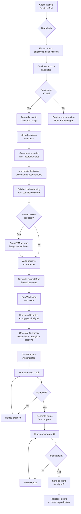
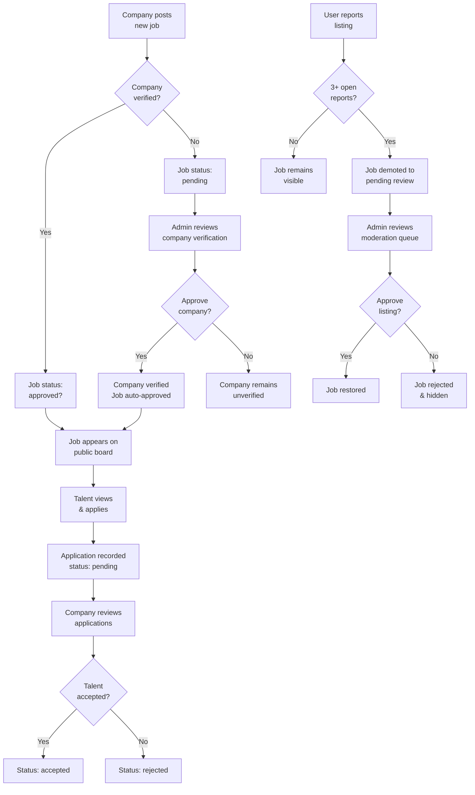
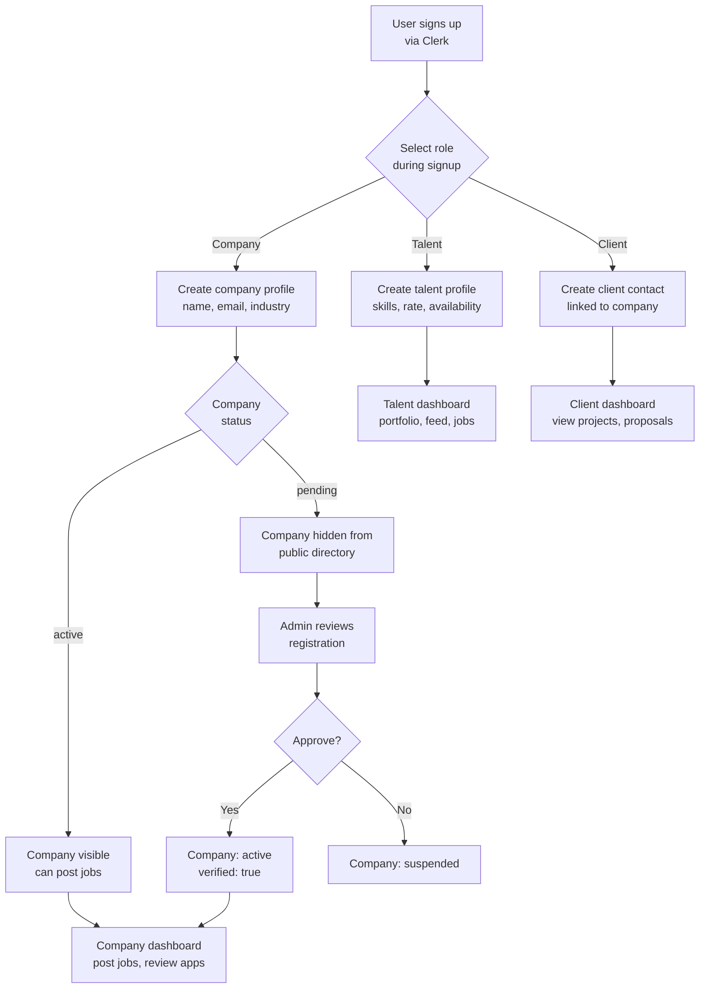
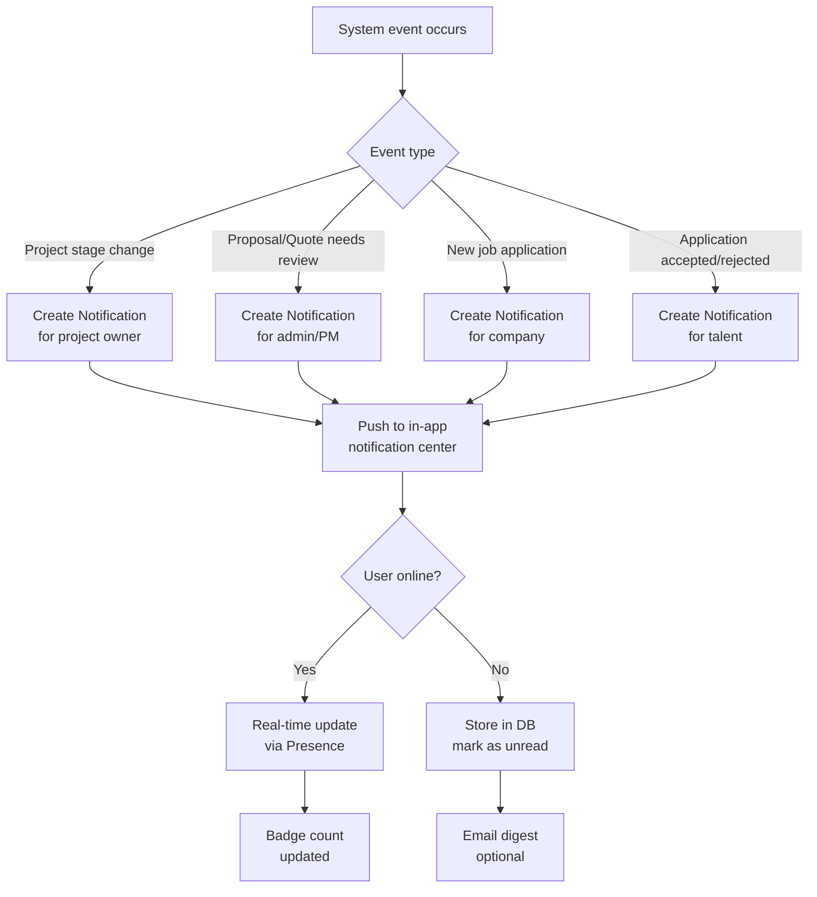

# Milestone 2 — Flowcharts

## 1. Project Intake & Creative Workflow Flowchart



## 2. Job Posting & Approval Flowchart



## 3. User Registration & Role Flowchart



## 4. AI Workflow Automation Flowchart

```mermaid
flowchart TD
    A[New project created] --> B[AI Agent:<br/>Brief Analyzer]
    B --> C[Extract structured data<br/>from creative brief]
    C --> D[Store in Brief model]

    D --> E[Trigger: Client Call<br/>scheduled/completed]
    E --> F[AI Agent:<br/>Transcript Analyzer]
    F --> G[Parse transcript lines<br/>extract speakers, decisions, actions]
    G --> H[Store in Transcript model]

    H --> I[AI Agent:<br/>Understanding Builder]
    I --> J[Map raw info to<br/>wants, objectives, risks, missing]
    J --> K[Assign attr: ai|human|mixed<br/>confidence score]
    K --> L[Store in Understanding<br/>& Insight models]

    L --> M[AI Agent:<br/>Brief Synthesizer]
    M --> N[Combine Brief + Transcript<br/>+ Understanding]
    N --> O[Generate Project Brief]
    O --> P[Store in ProjectBrief model]

    P --> Q[Trigger: Workshop<br/>completed]
    Q --> R[AI Agent:<br/>Synthesis Engine]
    R --> S[Merge workshop insights<br/>with project brief]
    S --> T[Generate executive summary,<br/>strategic + creative direction]
    T --> U[Store in Synthesis model]

    U --> V[AI Agent:<br/>Proposal Drafter]
    V --> W[Use synthesis to draft<br/>proposal sections]
    W --> X[Store in Proposal model<br/>status: draft]

    X --> Y[Trigger: Proposal<br/>approved by human]
    Y --> Z[AI Agent:<br/>Quote Generator]
    Z --> AA[Calculate line items,<br/>tax, discount, terms]
    AA --> AB[Store in Quote model<br/>status: draft]

    AB --> AC[Trigger: Quote<br/>approved by human]
    AC --> AD[Mark project stage:<br/>approval]
    AD --> AE[Send to client<br/>for final sign-off]
```

## 5. Notification & Real-time Updates Flowchart


