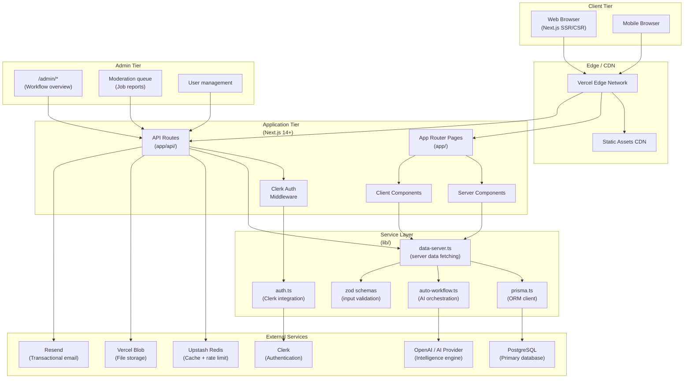
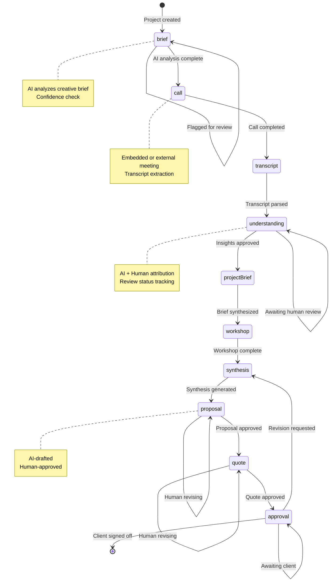
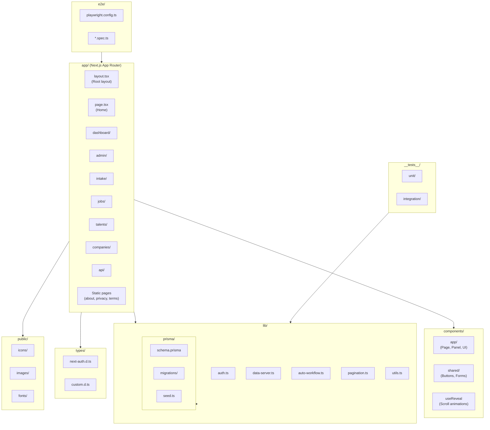
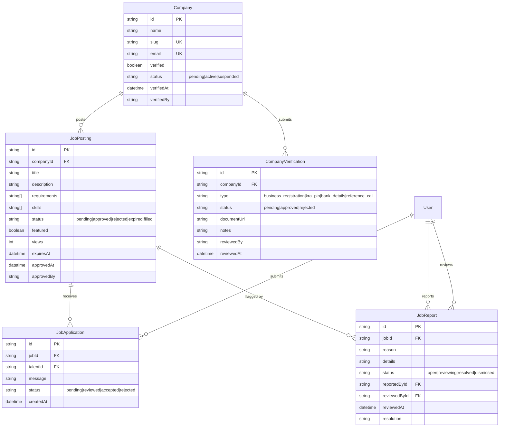

# Milestone 2 — Additional UML Diagrams

## 1. Component Diagram — System Architecture



## 2. State Diagram — Project Lifecycle



## 3. Package Diagram — Code Organization



## 4. Activity Diagram — Admin Moderation Workflow

```mermaid
activityDiagram-v2
    title Admin Moderation Queue

    start
    :User reports job listing;
    :Create JobReport (status: open);
    :Increment report count;

    if :Report count >= 3? then
        :Demote job to "pending";
        :Job removed from public board;
    else
        :Job remains visible;
    endif

    :Notify admin of new report;

    while :Pending reports exist? is true
        :Admin opens moderation queue;
        :Fetch open reports;
        :Review job listing details;
        :Review report reason + details;

        if :Report valid? then
            switch :Action
            case :Reject listing
                :Update JobPosting.status = "rejected";
                :Update JobReport.status = "resolved";
                :Notify company of rejection;
                :Job hidden from board;
            case :Keep listing
                :Update JobReport.status = "dismissed";
                :Job remains visible;
                :Notify reporter of decision;
            case :Request revision
                :Update JobPosting.status = "pending";
                :Send revision request to company;
                :Update JobReport.status = "reviewing";
            endswitch
        else
            :Update JobReport.status = "dismissed";
            :Dismiss false report;
            :Flag reporter if pattern;
        endif

        :Log action in AuditLog;
    endwhile

    stop
```

## 5. Entity Relationships — Job Board Subsystem


