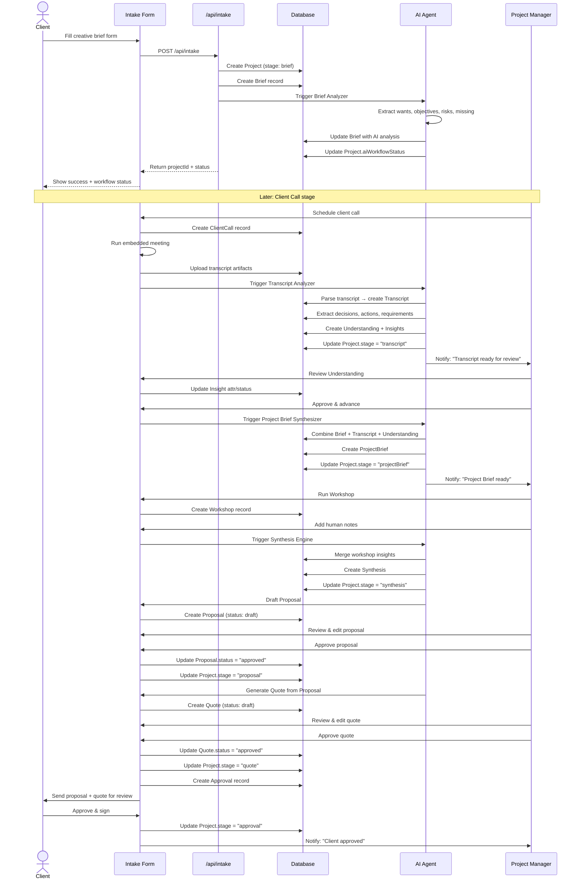
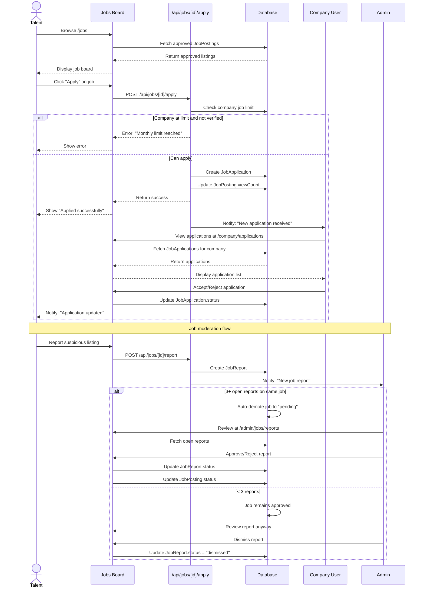

# Milestone 2 — UML Diagrams

## 1. Class Diagram — Core Domain Models

```mermaid
classDiagram
    class User {
        +String id
        +String clerkId
        +String email
        +String name
        +String initials
        +Role role
        +String companyId
        +Int level
        +Int levelXP
        +DateTime createdAt
        +DateTime updatedAt
        +projects[] Project
        +tasks[] Task
        +talentProfile Talent?
        +jobApplications[] JobApplication
        +feedPosts[] FeedPost
        +reactions[] Reaction
        +comments[] Comment
        +notifications[] Notification
    }

    class Project {
        +String id
        +String slug
        +String name
        +String companyId
        +String client
        +String clientId
        +String type
        +Stage stage
        +Int progress
        +ProjStatus status
        +DateTime lastActivity
        +String nextAction
        +String ownerId
        +Int aiActivity
        +Json deliverables
        +Json aiWorkflowStatus
        +DateTime createdAt
        +DateTime updatedAt
        +brief Brief?
        +call ClientCall?
        +transcript Transcript?
        +understanding Understanding?
        +projectBrief ProjectBrief?
        +workshop Workshop?
        +synthesis Synthesis?
        +proposal Proposal?
        +quote Quote?
        +approvals[] Approval
        +contactReport ContactReport?
        +productionMeeting ProductionMeeting?
        +tasks[] Task
        +invoices[] Invoice
    }

    class Brief {
        +String id
        +String projectId
        +String clientName
        +String company
        +String contact
        +String industry
        +String title
        +String businessObjective
        +String[] objectives
        +String audience
        +String brand
        +String direction
        +String[] deliverables
        +String budget
        +String timeline
        +String[] attachments
        +String context
        +String[] aiWants
        +String[] aiObjectives
        +String[] aiRequirements
        +String[] aiRisks
        +String[] aiMissing
        +String[] aiQuestions
        +Int aiConfidence
        +DateTime createdAt
        +DateTime updatedAt
    }

    class ClientCall {
        +String id
        +String projectId
        +String date
        +String duration
        +String[] participants
        +String summary
        +String roomName?
        +String roomUrl?
        +String meetingSource
        +Json? artifacts
        +String? transcript
        +DateTime createdAt
        +DateTime updatedAt
    }

    class Transcript {
        +String id
        +String projectId
        +Json lines
        +Json moments
        +String[] decisions
        +Json actions
        +String[] requirements
        +DateTime createdAt
        +DateTime updatedAt
    }

    class Understanding {
        +String id
        +String projectId
        +Int confidence
        +DateTime createdAt
        +DateTime updatedAt
        +insights[] Insight
    }

    class Insight {
        +String id
        +String group
        +String text
        +Attr attr
        +ReviewStatus status
        +String? note
        +String understandingId
        +DateTime createdAt
        +DateTime updatedAt
    }

    class ProjectBrief {
        +String id
        +String projectId
        +String summary
        +String businessObjective
        +String creativeObjective
        +String audience
        +String direction
        +String[] deliverables
        +String timeline
        +String budget
        +String[] risks
        +String[] openQuestions
        +String[] successCriteria
        +DateTime createdAt
        +DateTime updatedAt
    }

    class Workshop {
        +String id
        +String projectId
        +String humanNotes
        +DateTime createdAt
        +DateTime updatedAt
        +insights[] WorkshopInsight
    }

    class WorkshopInsight {
        +String id
        +String group
        +String text
        +Attr attr
        +ReviewStatus status
        +String workshopId
        +DateTime createdAt
        +DateTime updatedAt
    }

    class Synthesis {
        +String id
        +String projectId
        +String executiveSummary
        +String strategicDirection
        +String creativeDirection
        +String approach
        +String[] deliverables
        +String timeline
        +String[] risks
        +String[] openQuestions
        +String[] decisions
        +DateTime createdAt
        +DateTime updatedAt
    }

    class Proposal {
        +String id
        +String projectId
        +String clientDetails
        +String overview
        +String problem
        +String solution
        +String[] scope
        +String[] deliverables
        +String timeline
        +String[] team
        +String investment
        +String terms
        +ReviewStatus status
        +Json sections
        +String? publicToken
        +Boolean sentToClient
        +DateTime? sentAt
        +DateTime createdAt
        +DateTime updatedAt
    }

    class Quote {
        +String id
        +String projectId
        +Json services
        +Int discount
        +Int tax
        +String paymentTerms
        +ReviewStatus status
        +String? publicToken
        +Boolean sentToClient
        +DateTime? sentAt
        +DateTime createdAt
        +DateTime updatedAt
    }

    class Approval {
        +String id
        +String projectId
        +String kind
        +String? refId
        +String title
        +String? note
        +ReviewStatus status
        +String? decidedBy
        +DateTime createdAt
        +DateTime updatedAt
    }

    class Company {
        +String id
        +String name
        +String slug
        +String email
        +String? phone
        +String? website
        +String? industry
        +String? location
        +String? description
        +String? logo
        +Boolean verified
        +DateTime? verifiedAt
        +String? verifiedBy
        +String status
        +DateTime joinedAt
        +DateTime createdAt
        +DateTime updatedAt
        +users[] User
        +clients[] Client
        +projects[] Project
        +jobs[] JobPosting
        +verifications[] CompanyVerification
    }

    class Client {
        +String id
        +String name
        +String company
        +String companyId
        +String email
        +String? phone
        +String? industry
        +String status
        +String? source
        +String? value
        +String? lastContact
        +String? nextAction
        +String[] tags
        +String? notes
        +Json? dossier
        +DateTime createdAt
        +DateTime updatedAt
        +projects[] Project
    }

    class JobPosting {
        +String id
        +String companyId
        +String title
        +String description
        +String[] requirements
        +String[] skills
        +String? budget
        +String? budgetMin
        +String? budgetMax
        +String? timeline
        +String? location
        +String type
        +String? category
        +String? experience
        +String? education
        +String status
        +Boolean featured
        +Int views
        +DateTime? expiresAt
        +DateTime? approvedAt
        +String? approvedBy
        +DateTime? rejectedAt
        +String? rejectedBy
        +String? rejectionReason
        +DateTime postedAt
        +DateTime createdAt
        +DateTime updatedAt
        +applications[] JobApplication
        +reports[] JobReport
    }

    class JobApplication {
        +String id
        +String jobId
        +String talentId
        +String? message
        +String status
        +DateTime createdAt
        +DateTime updatedAt
    }

    class Talent {
        +String id
        +String? userId
        +String name
        +String email
        +String[] skills
        +Int experience
        +Float rating
        +String availability
        +String rate
        +String? portfolio
        +String? notes
        +DateTime createdAt
        +DateTime updatedAt
    }

    class Task {
        +String id
        +String projectId
        +String? assigneeId
        +String title
        +String? description
        +String status
        +String? priority
        +DateTime? dueDate
        +DateTime? completedAt
        +DateTime createdAt
        +DateTime updatedAt
    }

    class Invoice {
        +String id
        +String projectId
        +String number
        +Json items
        +Int subtotal
        +Int discount
        +Int tax
        +Int total
        +String paymentTerms
        +String status
        +DateTime? dueDate
        +DateTime? paidAt
        +DateTime createdAt
        +DateTime updatedAt
    }

    %% Relationships
    User "1" -- "*" Project : owns
    User "1" -- "*" Task : assigned
    User "1" -- "*" JobApplication : submits
    User "1" -- "*" FeedPost : authors
    User "1" -- "*" Reaction : gives
    User "1" -- "*" Comment : writes
    User "1" -- "*" Notification : receives
    User "*" -- "1" Company : belongs to
    User "1" -- "0..1" Talent : has profile

    Project "1" -- "1" Brief : has
    Project "1" -- "1" ClientCall : has
    Project "1" -- "1" Transcript : has
    Project "1" -- "1" Understanding : has
    Project "1" -- "1" ProjectBrief : has
    Project "1" -- "1" Workshop : has
    Project "1" -- "1" Synthesis : has
    Project "1" -- "1" Proposal : has
    Project "1" -- "1" Quote : has
    Project "1" -- "*" Approval : has
    Project "1" -- "1" ContactReport : has
    Project "1" -- "1" ProductionMeeting : has
    Project "1" -- "*" Task : has
    Project "1" -- "*" Invoice : has

    Understanding "1" -- "*" Insight : contains
    Workshop "1" -- "*" WorkshopInsight : contains

    Company "1" -- "*" User : employs
    Company "1" -- "*" Client : has contacts
    Company "1" -- "*" Project : sponsors
    Company "1" -- "*" JobPosting : posts
    Company "1" -- "*" CompanyVerification : submits

    Client "*" -- "1" Company : works for
    Client "1" -- "*" Project : contacts for

    JobPosting "1" -- "*" JobApplication : receives
    JobPosting "1" -- "*" JobReport : flagged by

    Talent "1" -- "0..1" User : linked to
```



## 2. Sequence Diagram — Project Intake to Proposal



## 3. Sequence Diagram — Job Application Flow



## 4. Activity Diagram — AI Auto-Workflow

```mermaid
activityDiagram-v2
    title AI Auto-Workflow Engine

    start
    :New Project Created;
    :Set stage = brief;

    while :Project not complete? is true
        switch :Project.stage
        case :brief
            :AI Brief Analyzer runs;
            :Extract wants, objectives, risks, missing;
            :Calculate confidence;
            if :Confidence >= 70%? then
                :stage = call;
                :Notify PM;
            else
                :Flag for human review;
                :Hold at brief;
            endif
        case :call
            :Wait for call completion;
            :AI Transcript Analyzer runs;
            :Extract decisions, actions, requirements;
            :Create Understanding + Insights;
            :stage = transcript;
        case :transcript
            :stage = understanding;
        case :understanding
            if :Insights need human review? then
                :Notify PM for review;
                :Wait for approval;
            else
                :Auto-approve insights;
            endif
            :stage = projectBrief;
            :AI Brief Synthesizer runs;
        case :projectBrief
            :stage = workshop;
            :Notify PM to run workshop;
            :Wait for workshop completion;
        case :workshop
            :AI Synthesis Engine runs;
            :Create Synthesis;
            :stage = synthesis;
        case :synthesis
            :AI Proposal Drafter runs;
            :Create Proposal (draft);
            :stage = proposal;
            :Notify PM for review;
            :Wait for proposal approval;
        case :proposal
            if :Proposal approved? then
                :stage = quote;
                :AI Quote Generator runs;
                :Create Quote (draft);
                :Notify PM for review;
                :Wait for quote approval;
            else
                :Notify PM to revise;
                :Wait for resubmission;
            endif
        case :quote
            if :Quote approved? then
                :stage = approval;
                :Send to client;
                :Wait for client sign-off;
            else
                :Notify PM to revise;
                :Wait for resubmission;
            endif
        case :approval
            if :Client approved? then
                :Project complete;
                stop
            else
                :Notify PM for revision;
                :Return to relevant stage;
            endif
        endswitch
    endwhile

    stop
```
